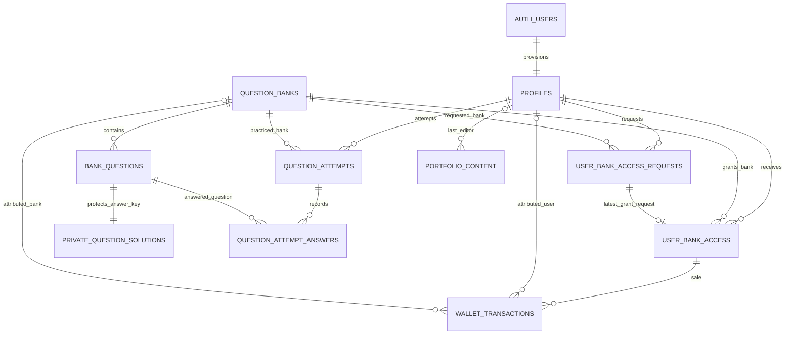

# Backend map and production data audit

Updated: 2026-09-14. Baseline: `c294ca7` on `main`.
Production: https://lhcc-lb.com (also https://lhcc-portfolio.vercel.app).
Supabase: `lcazjsmmegwwnmuupsko`. Vercel: `lhcc-portfolio`.

This document describes the implemented system. The former demo architecture in
historical handoff notes is superseded. Auth, authorization, course content,
requests, grants, attempts, portfolio, and wallet all persist in Supabase.
No production business records are loaded from localStorage or mock files.
Form drafts, filters, open dialogs, and feedback are transient UI state.

## Feature map

| Feature / UI | Tables | Read path | Write path | Authorization and RLS |
| --- | --- | --- | --- | --- |
| Login, signup, logout, recovery: `/login`, `/signup`, `/auth/callback` | `auth.users`, `profiles` | Auth claims and own profile in `lib/auth/server.ts` | `actions/auth.ts`: Supabase Auth calls; profile provisioning trigger | Verified Supabase identity; trusted DB role and effective status. Signup metadata cannot choose an elevated role. |
| Profile/settings: student profile, admin settings, portal shells | `profiles` | `requireRole` and own-profile SELECT | Admin user actions; password updates through Supabase Auth | Own-profile RLS; no client role changes. No unrelated dashboard query required for profile rendering. |
| Admin users: `/admin/users` | `auth.users`, `profiles` | `listUsers` joins paged Auth users with paged profile rows on the server | `createUser`, `updateUser`, `deactivateUser`, `reactivateStudent`, `reactivateTeacher` | `authorizeActiveAdmin` before the server-only administrative client. Admin account protection remains. |
| Student banks: `/student/question-banks` | `question_banks`, `user_bank_access_requests`, `user_bank_access` | `getStudentBanks` in `lib/bank-access/server.ts`; ordered pagination | `requestBankAccess` | Active STUDENT; active catalog, own requests/grants via RLS. Latest request plus actual grant derives access state. |
| Admin banks/questions: `/admin/question-banks/**` | `question_banks`, `bank_questions`, `private.question_solutions` | `getAdminBankData` → `admin_bank_data` RPC | `manageBankContent` → `manage_bank_content` RPC | ADMIN/status checked in action and private RPC. Correct answers are returned only by the admin RPC. |
| Question options | `bank_questions.options` JSONB; `private.question_solutions` | Student allowlist contains only option id/text; admin RPC merges answer keys | Same question management RPC | Existing canonical schema uses JSONB options, not separate `questions` or `question_options` tables. No duplicate concepts added. |
| Access review: `/admin/access-requests` | requests, grants, banks, profiles, wallet ledger | `getAdminRequests` → `list_bank_access_requests` RPC | `approveBankAccessRequest` / `rejectBankAccessRequest` → `review_bank_access` | Admin-only; row locking, pending-state check, active student/bank checks; trusted bank price. |
| Approved course: `/student/banks/[bankId]` | banks, questions, grants, attempts, answers | `getStudentCourse` checks grant and active bank, then loads safe questions and most recent active/completed attempt | `submitBankAnswer` → `submit_bank_answer` | STUDENT/status and grant checked server-side and inside RPC/RLS. In-progress and completed answer feedback reloads from saved rows. |
| Attempts and answers | `question_attempts`, `question_attempt_answers`, private solutions | Own attempts/answers through RLS; authorized staff reporting | First answer creates an attempt; selected option is validated and graded by backend; last answer completes and scores it | No direct client writes. Student cannot write a score or inspect another student's attempts. One in-progress attempt per student/bank; one answer per attempt/question. |
| Student progress/dashboard/analytics: `/student`, `/student/analytics` | own attempts/answers, active banks, own requests/grants, allowed questions | `getDashboardData("student")` → session client, paged RLS queries → pure reporting functions | Derived from answer and access operations | No administrative client for students. Accuracy/score and counts come from stored records. Progress counts unique active questions rather than repeated answers. |
| Teacher banks/dashboard/analytics: `/teacher`, `/teacher/question-banks`, `/teacher/analytics`, `/teacher/students` | published banks/questions, attempts/answers | `getDashboardData("teacher")`, `getTeacherBankSummaries` use session client and existing teacher RLS | No teacher mutation workflow is added | Existing active-teacher policy supports bank/question and learning-report reads. Metric is participating learners from attempts; no profile directory or wallet is read. `/teacher/students` presents cohort analytics, not an invented roster. |
| Admin dashboard: `/admin` | profiles, banks/questions, requests/grants, attempts/answers, portfolio, ledger | `getDashboardData("admin")`; learning data through RLS, verified admin profile directory read, guarded wallet RPC | Derived from real operations | ADMIN required before reads. Active teacher count excludes expired activation periods. All totals are based on database rows. |
| Admin student activity: `/admin/users/[userId]/activity` | Auth/profiles, banks, selected student's attempts | `getStudentActivityData`; `getAdminUserUsageSummaries` | Derived from real attempts | ADMIN guard. Query selects only requested student's attempts, never all students' answer rows. Last activity uses backend update time. |
| Wallet: `/admin/wallet` | `wallet_transactions` with profile/bank/access links | `getAdminWalletTransactions` → `admin_wallet_data` RPC | `createWalletTicket`, `updateWalletTicket`, `deleteWalletTicket` → `manage_wallet_transaction`; paid approval creates sale | ADMIN/status required twice. Table has no browser grants and deny policy. Balance is signed SUM(amount), with no independent balance field. |
| Portfolio editor: `/admin/portfolio` | `portfolio_content` | `getPortfolioContent` → published DB content | `savePortfolioContent` / `resetPortfolioContent` → RPCs | ADMIN guarded server action and private function; validation in TypeScript and database. Draft state is not persistence. |
| Public portfolio: `/about`, `/services`, `/platform`, `/contact` | `portfolio_content` | Server component → `getPortfolioContent` | None for public visitors | Public column-limited SELECT of published rows. Defaults/audit columns not exposed. Empty content gets a coming-soon state; malformed/incomplete content or failure gets error boundary. |
| Recent activity | existing timestamped rows above | Attempts, requests/reviews; admins also see new profiles, wallet entries, edited portfolio rows | No second event store | Role-visible records only, sorted by event timestamp. Not a complete historical audit log: portfolio keeps latest revision only. |
| Exams | No implemented exam table | Explicit not-configured state | None | No fabricated exam dates, records, counts, or new teacher permissions. |
| Homepage | Static editorial content only | Server-rendered marketing labels; no personal statistics | Code change for homepage copy | Fixed bank count removed. No fake users/scores/transactions. CMS scope remains the four public portfolio pages. |

## Database relationship map

Options are stored in `bank_questions.options` as `[{id,text}]`.
The one correct QCU option id is in the unexposed private schema.

No tables, columns, RPCs, or policies were created/changed in this follow-up.
Local and production migration histories match through
`20260913175259_harden_wallet_and_add_fk_indexes`.
The preceding migration created `question_attempts`, `question_attempt_answers`,
`wallet_transactions`, and `portfolio_content`; extended `question_banks`
with image/price/creator and `user_bank_access` with id/price/revocation/audit fields.
Previously applied files remain untouched. Generated database types match the
current production generator output after newline normalization.

## Actions and RPC contract

All paths below are under `src/`. Auth actions use Supabase Auth, not custom
password code. Database RPCs are public SECURITY INVOKER wrappers around guarded
private functions with a fixed empty search path.

| Action / RPC | Caller and input | Effects/result |
| --- | --- | --- |
| `login({email,password})` | Valid credentials | Supabase password sign-in, effective profile check, role portal redirect; disabled accounts signed out. |
| `registerAccount(profile,password,...)` | Public, validated signup form | Supabase signup and trusted profile trigger; ACTIVE STUDENT without bank grants. |
| `logout`, `requestPasswordReset`, `updatePassword` | Auth session or recovery flow as applicable | Supabase sign-out/recovery/password update. No application password storage. |
| `listUsers` | Active ADMIN | Paged real Auth/profile join; server-result error on failure. |
| `createUser` | Active ADMIN, validated user fields | Auth invitation and profile update; existing compensation cleanup on profile failure. No invitations are sent by the audit tests. |
| `updateUser`, `deactivateUser`, reactivation actions | Active ADMIN, managed user id and validated fields | Protected profile/Auth updates with existing activation and administrator protection rules. |
| `requestBankAccess(bankId)` → `request_bank_access` | Active STUDENT, active ungranted bank | New PENDING request; duplicate pending prevented; prior decisions retained. |
| approve/reject → `review_bank_access(request_id,decision,reason)` | Active ADMIN | Reviewed timestamp/reviewer; approval activates grant and inserts one BANK_SALE for paid access in one transaction. Retry cannot create duplicate sale. |
| `manageBankContent(operation,id,input)` → `manage_bank_content` | Active ADMIN; save/delete bank or question | Persistent content with QCU validation; FK-protected deletion respects existing history. |
| `submitBankAnswer(questionId,optionId)` → `submit_bank_answer` | Active STUDENT with approved active bank | Serializes attempt creation, validates option, grades via private key, stores answer and score; returns correctness, attempt id, completion flag, score. Retry during in-progress attempt returns saved result. |
| `savePortfolioContent(input)` → `save_portfolio_content(payload)` | Active ADMIN; complete validated four-section model | Atomic content/revision update and cache revalidation; returns persisted published content. |
| `resetPortfolioContent()` → `reset_portfolio_content` | Active ADMIN, UI confirmation | Restores DB `default_content`, increments revision and revalidates. No frontend default import. |
| `createWalletTicket` / `updateWalletTicket` / `deleteWalletTicket` → `manage_wallet_transaction` | Active ADMIN; manual income/expense id, amount/date/text | Writes only manual types; automatic transactions are read-only through this operation. |
| `admin_bank_data`, `list_bank_access_requests`, `admin_wallet_data` | Active ADMIN | Guarded read RPCs with safe result shaping for admin controls. |

There are no separate `startAttempt`/`completeAttempt` actions: the answer
submission RPC owns those transitions. There is currently no explicit retake UI.
The RPC can create a new attempt after completion, but a refreshed course retains
the latest completed answers for review. Changing the question set during an
attempt and full exam scheduling need separate product rules.

## RLS, constraints, and secret review

| Table | Policies/restrictions reviewed |
| --- | --- |
| `profiles` | Own-profile SELECT only; administrative directory/writes use server-only client after trusted active ADMIN authorization. |
| `question_banks` | `bank_catalog`: active banks for enabled students/teachers; admin catalog. |
| `bank_questions` | `approved_questions`: student needs active account/bank/grant; existing teacher/admin read rules. |
| `private.question_solutions` | `no_direct_solution_reads`; correct keys never serialized to student before answer submission. |
| `user_bank_access_requests` | `own_requests`, `own_pending_request`; own active-student pending insert only, no client review/update permission. |
| `user_bank_access` | `own_access`; own active-student read or admin; no client grants. |
| `question_attempts` | `own_or_staff_attempts`; own history or enabled staff. Client insert/update/delete denied. |
| `question_attempt_answers` | `own_or_staff_attempt_answers`; restricted through attempt ownership/staff rules, no direct writes. |
| `wallet_transactions` | `no_direct_wallet_access`, no browser table grants; guarded RPC only. |
| `portfolio_content` | `published_portfolio_content`; only published rows and explicit safe columns public. Writes guarded. |

All nine public application tables and the private solution table have RLS.
Existing own-history policies permit a suspended student to read their *own*
historical attempts via direct API, while app access and question submission are
denied. This is the existing policy, not broadened in this task.

Constraints checked: profile/Auth one-to-one, valid enums and activation bundle,
nonnegative bank/access price, unique user-bank grant, unique pending request,
unique in-progress attempt, unique answer per attempt/question, valid totals/
score/status, wallet sign/type and unique sale per access. Question write RPC
enforces distinct option ids and exactly one correct QCU option; answer trigger
ensures the selected option and question belong to the attempt bank.

Only `lib/supabase/admin.ts` reads `SUPABASE_SECRET_KEY` /
`SUPABASE_SERVICE_ROLE_KEY`; it imports `server-only`. No secret is referenced
by a NEXT_PUBLIC variable or client module. Student and teacher reporting now
uses only the session client. Auth/profile administrative operations remain the
only application consumers of privileged profile/Auth reads.

## Demo inventory and disposition

The following obsolete files were already removed in baseline commit `c294ca7`
and remain removed; they were not recreated or removed again:

- `src/data/analytics.mock.ts`, `question-banks.mock.ts`, `wallet.mock.ts`
- `src/data/default-question-banks.ts`, `default-questions.ts`,
  `default-student-usage.ts`, `default-users.ts`, `default-wallet-data.ts`
- `src/data/portfolio-content.default.ts`
- `src/features/users/user-management-provider.tsx`
- `src/features/portfolio-content/portfolio-content-provider.tsx`
- `src/services/admin-question-bank.storage.ts`, `analytics.service.ts`,
  `portfolio-content.storage.ts`, `question-banks.service.ts`,
  `user-management.storage.ts`, `wallet-transactions.ts`, `wallet.service.ts`
- `src/types/wallet.ts`

This follow-up removed the static “Six medical Qbanks” business count and fixed
the derived-data/persistence issues described above. No additional fake business
arrays were found. Dashboard/analytics fake points, balances and counters were
already replaced in the preceding migration.

Remaining matches, all outside production demo behavior:

| Match / location | Classification and reason |
| --- | --- |
| `src/app/layout.tsx`: `localStorage.getItem("lhcc-theme")` | UI preference only: initial theme. |
| `src/components/ui/theme-toggle.tsx`: `localStorage.setItem("lhcc-theme", ...)` | UI preference only: theme selection. These are the only production browser storage calls. |
| `AdminQuestionBankProvider` in `features/question-banks/admin-question-bank-provider.tsx` | Production backend adapter, not demo state: receives server RPC data; all mutations await server action then refresh. Kept. |
| `scripts/backend-reporting.test.mjs` | Test-only synthetic inputs covering API caps, failures, score boundaries, duplicates, event ordering, ledger arithmetic. Never imported by production. |
| `scripts/course-browser-test.mjs` | Isolated browser test infrastructure. Public read checks are default; auth writes require explicit opt-in and run only locally. `--no-default-browser-check` is a browser option, not data. |
| `supabase/tests/student_course_access.sql` | Transactional test identities/content and SQL assertions; always rolls back. Never frontend imports. |
| `supabase/seed.sql` | Development-only seed instructions; no production frontend dependency. |
| Applied SQL migrations | Historical schema/initial database content, not client-side fallback. Existing records preserved. |
| `README.md`, `PROJECT_HANDOFF.md` historical sections, `docs/course-access-request.md`, `docs/student-course-access.md`, `docs/ui-responsive-review.md` | Documentation/request history; old descriptions explicitly superseded by current checkpoint/map. README describes the current production architecture. |
| This document | Audit inventory of removed names and constraints. |
| `src/data/countries.ts`, navigation, role/enum labels, empty form options, score histogram ranges, marketing capabilities | Legitimate reference/presentation data, not business records. Country names are generated from maintained phone/Intl reference libraries. |

No `sessionStorage`, demo session, mock-import fallback, or localStorage
users/banks/questions/requests/grants/attempts/progress/wallet/portfolio/analytics/
activity remains in production source. Old browser keys are never read or
automatically imported into trusted production data.

## Verification and production state

- SQL integration passed against the linked production project inside BEGIN /
  ROLLBACK: provisioning, unauthorized role changes, bank/question CRUD reads,
  access requests, paid approval/retry, answer/retry, score persistence,
  cross-student isolation, teacher reporting, wallet CRUD, portfolio save/reset.
- Before/after content digests match for profiles, banks, questions, portfolio.
  Baseline counts: 2 Auth users, 2 profiles, 6 banks, 3 questions, 1 request,
  0 grants, 0 attempts, 0 answers, 0 ledger transactions, 4 portfolio rows.
  Zero attempts/grants/ledger totals are valid, not substituted with demo values.
- Generated Supabase types match production exactly after newline normalization.
- Regression suite: `node --experimental-strip-types --test scripts/backend-reporting.test.mjs`: seven tests passed.
- Node 22.23.2: typecheck, lint, production build and `git diff --check` passed.
- Existing production public/auth pages passed isolated headless Edge checks at
  390, 430, 768, and 1366px, including overflow, touch targets, form text size,
  runtime exceptions, and anonymous protection for admin, student and teacher routes.
  The deployment for this follow-up and its post-push verification are recorded in the final turn report.
- Security advisor: pre-existing
  [leaked-password protection disabled](https://supabase.com/docs/guides/auth/password-security#password-strength-and-leaked-password-protection).
  Performance: ten [unused-index informational findings](https://supabase.com/docs/guides/database/database-linter?lint=0005_unused_index);
  no new policy/index/schema change in this follow-up.
- Browser responsive tests use Chromium/Edge emulation, not physical iOS/Android
  hardware or Safari. Public route/anonymous-guard tests do not prove signed-in
  form submission or cross-device authenticated interaction.
- Authenticated create-user invitation, browser bank/question edit, approval,
  attempt, wallet and portfolio refresh flows were NOT rerun through a signed-in
  browser in this follow-up. SQL persisted-read tests exercise the backend
  contracts without sending invitations or leaving production test records.
- Git auto-deployment must be verified against the pushed commit. No manual
  Vercel deployment is needed.

## Remaining supported boundaries

Exams/assignments and teacher cohort management are explicitly unconfigured;
teacher reporting uses existing allowed data. Account settings currently show
profile information; profile changes remain admin-managed. Retake controls,
question versioning within an active attempt, full historical audit logs,
refund/price-adjustment workflows, and a database aggregate reporting service
for high data volume are separate future work. Current reports exhaust paged
queries rather than silently truncating, but are not snapshot-isolated across
pages while concurrent edits occur. No new permissions or product rules were
invented to fill these gaps.
